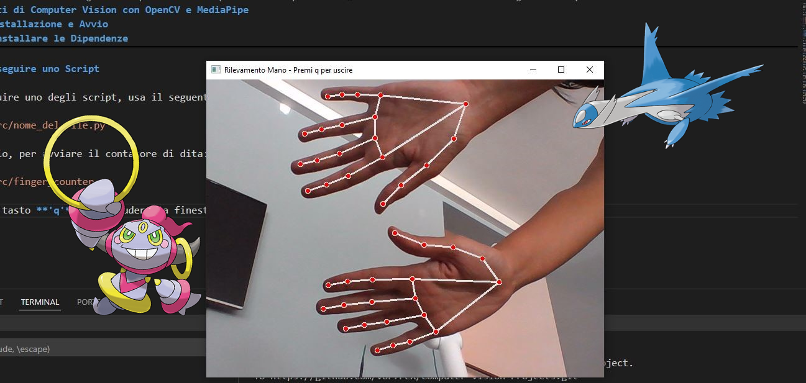

# Progetti di Computer Vision con OpenCV e MediaPipe

Questa è una raccolta di script Python interattivi che utilizzano le librerie **OpenCV** e **MediaPipe** per il rilevamento in tempo reale di mani, volto e gesti tramite la webcam.



---

## 📋 Elenco dei Progetti

All'interno della cartella `src/` troverai i seguenti script:

* `hand.py`: Rilevamento base dei landmark della mano.
* `eyes.py`: Isola e disegna il contorno degli occhi e delle iridi.
* `mouth.py`: Isola e disegna il contorno della bocca.
* `nose.py`: Isola e disegna il contorno del naso.
* `finger_counter.py`: Conta le dita alzate di una o due mani e mostra il totale a schermo.
* `volume_hand_controller.py`: Controlla il volume di sistema di Windows misurando la distanza tra pollice e indice.

---

## 🚀 Tecnologie Utilizzate

* **Python 3.11**
* **OpenCV** - Per l'acquisizione video e le operazioni sulle immagini.
* **MediaPipe** - Per i modelli di Machine Learning di rilevamento (Hands, Face Mesh).
* **pycaw** - Per il controllo dell'audio di sistema in Windows.
* **NumPy** - Per calcoli numerici e mappatura di valori.

---

## ⚙️ Installazione e Avvio

Segui questi passaggi per eseguire gli script sul tuo computer.

### 1. Prerequisiti

Assicurati di avere installato:
* [Python](https://www.python.org/) (sviluppato con la versione 3.11)
* [Git](https://git-scm.com/)

### 2. Clonare il Repository

Apri un terminale e clona questo repository:
```bash
git clone [https://github.com/TUO_USERNAME/NOME_REPOSITORY.git](https://github.com/TUO_USERNAME/NOME_REPOSITORY.git)
cd NOME_REPOSITORY
```
*(Sostituisci `TUO_USERNAME` e `NOME_REPOSITORY` con i tuoi)*

### 3. Creare l'Ambiente Virtuale

Crea un ambiente virtuale per isolare le dipendenze:
```bash
py -m venv venv
```

### 4. Attivare l'Ambiente Virtuale

Attiva l'ambiente appena creato:
```bash
.\venv\Scripts\activate
```

### 5. Installare le Dipendenze

Installa tutte le librerie necessarie con un solo comando grazie al file `requirements.txt`:
```bash
pip install -r requirements.txt
```

### 6. Eseguire uno Script

Per eseguire uno degli script, usa il seguente comando (assicurandoti che l'ambiente sia attivo):
```bash
python src/nome_del_file.py
```
Ad esempio, per avviare il contatore di dita:
```bash
python src/finger_counter.py
```
Premi il tasto **'q'** per chiudere la finestra dello script in esecuzione.